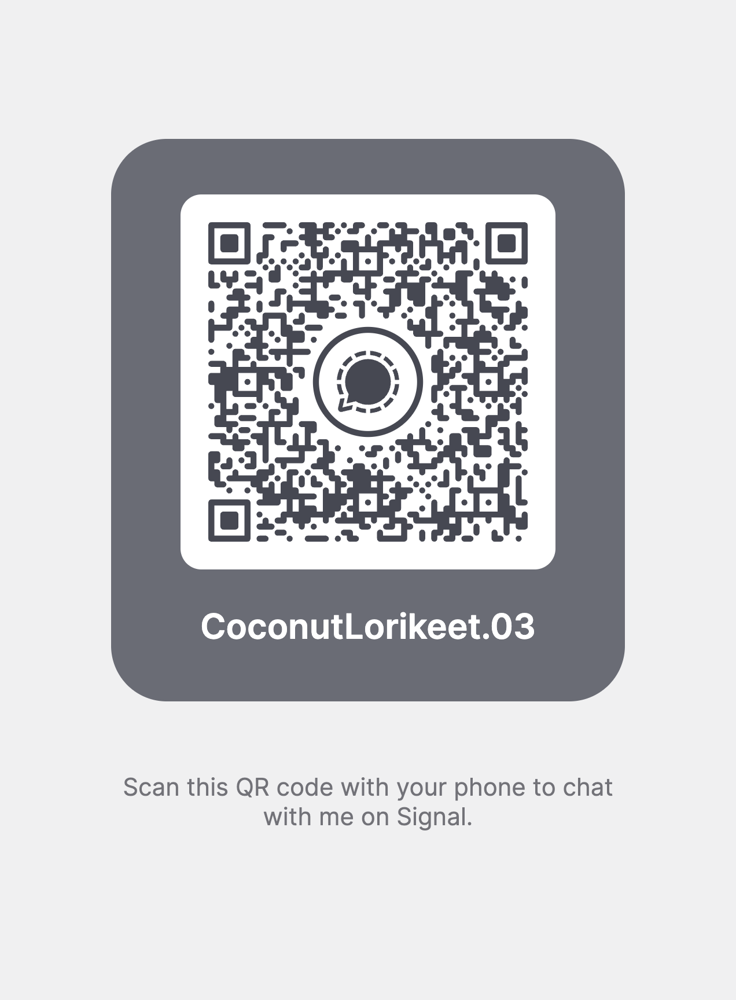

## Headline

Front-End Engineer

## About Me

<b>Senior Front-End Engineer</b> offering nine years of comprehensive experience in the full lifecycle of web application development. Demonstrated success in collaborating with cross-functional teams to deliver innovative solutions, transforming UI/UX designs into high-traffic applications that consistently meet the needs of thousands of daily users. Core competencies include Certified UX Design, complemented by a strong freelance portfolio that showcases a commitment to creating intuitive and user-friendly interfaces.

## Featured Projects

### Gallery
<b>Gallery</b>: (https://github.com/CoconutLorikeet/Gallery) -  A photo gallery with an alternate view mode - jQuery Plugin. An alternate view allows users to switch the gallery view mode to either a thumbnail list or a filmstrip view.

### Angular Google Maps
<b>Angular Google Maps</b>: (https://github.com/CoconutLorikeet/ang-google-maps) -  Initialize Initialize Google Maps, set location, drop pins, add Google Directions, and more.

### Angular Google Services
<b>Angular Google Maps</b>: (https://github.com/CoconutLorikeet/ang-google-services) -  Consuming Google's API services.

## 📊 GitHub Stats

## 📫 How to reach me:

| Channel | Information |
|---|---|
| <b>Email</b>: | [khalednobani@proton.me](mailto://khalednobani@proton.me) |
| <b>Indeed</b> | [https://profile.indeed.com/p/khaledn-w549tyk](https://profile.indeed.com/p/khaledn-w549tyk) |
| <b>Phone (Mobile)</b> | <a href="callto://66958324148">+66 9 5832 4148</a> |
| <b>Signal</b> | <a href="https://signal.me/#eu/RYGluyAvhTimh6ocRIcsoBRb_aY5Zic8fXGAVjkMqhIM3F3SrFZMbZmzD_Busuyw">+66 9 5832 4148</a>     |
| <b>Whatsapp</b> | <a href="callto://66958324148">+66 9 5832 4148</a>     |

## Skills

### Back-End Technologies
AWS Lambda, Cloudflare Workers, Django, Express.js, Go, MySQL, MongoDB, Python

### Design Tools
Adobe Illustrator, Adobe Photoshop, Figma, Sketch App

### Development methodologies
Agile Methodology, CD, CI, DevOps, Scrum

### Front-End Technologies
Bootstrap, Chrome DevTools, Firefox Developer Tools, HTML, CS, JavaScript, Less, React, Sass, Svelte, Vue.js

### Soft skills
Collaboration, Communication Skills, Critical Thinking, Leadership, Problem Solving, Teamwork

## 🔧 Technologies & Tools

